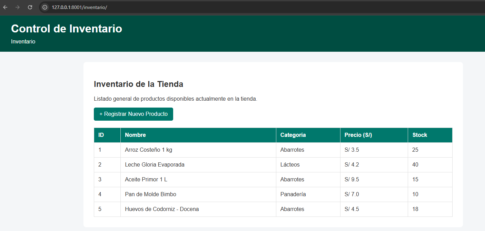
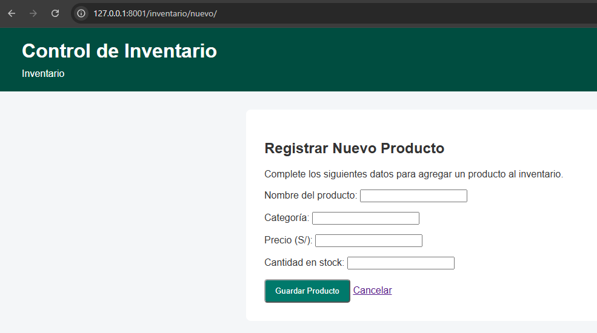
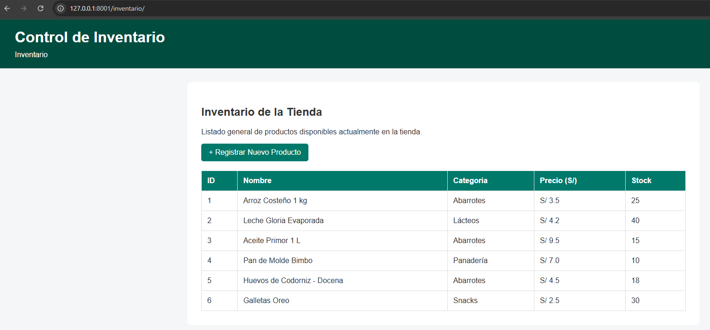
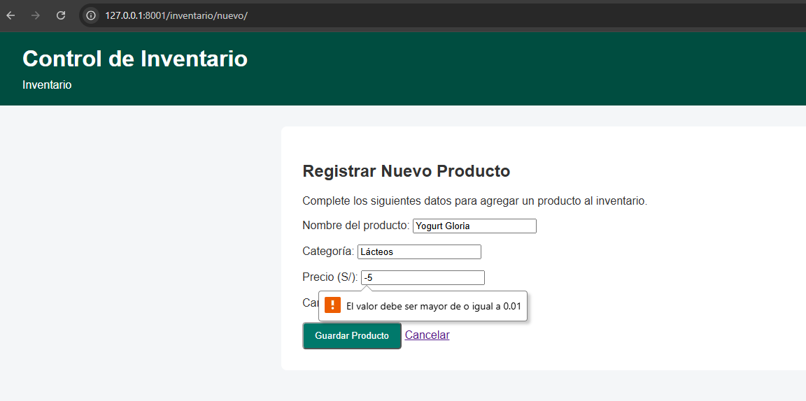

# Sistema de Inventario de Tienda

## Descripción del proyecto

Este proyecto consiste en una aplicación web desarrollada con Django para gestionar el inventario básico de una tienda de abarrotes.

La problemática identificada es que muchas tiendas pequeñas registran sus productos manualmente, dificultando consultar información como nombre, categoría, precio y stock disponible.

La aplicación permite visualizar productos registrados y agregar nuevos productos mediante un formulario web.

---

## Problemática

Las tiendas pequeñas necesitan una forma sencilla de organizar sus productos y consultar rápidamente la información del inventario.

---

## Requisitos funcionales

- El sistema debe permitir visualizar el listado de productos disponibles.
- El sistema debe permitir registrar nuevos productos.
- El sistema debe validar los datos ingresados mediante un formulario.
- El sistema debe mostrar los nuevos productos registrados en el listado.
- El sistema debe organizar productos por nombre, categoría, precio y stock.

---

## App desarrollada

La aplicación creada se denomina:

**inventory**

Esta App contiene:

- models.py: datos estáticos de productos.
- views.py: lógica para listar y crear productos.
- forms.py: formulario de registro.
- urls.py: rutas de la aplicación.
- templates: interfaz HTML.

---

## Tecnologías utilizadas

- Python
- Django 6.1
- HTML
- CSS
- Visual Studio Code

---

## Flujo MVT aplicado

Request → URL → View → Model → Template → Response

La aplicación inventory funciona dentro del mismo Project junto con landing, compartiendo la configuración principal definida en Sesion1.

## Capturas de funcionamiento

### 1. Listado de productos

Vista principal donde se muestra el inventario disponible de la tienda, incluyendo nombre del producto, categoría, precio y stock.

### 2. Formulario de registro de producto

Formulario utilizado para ingresar un nuevo producto al inventario mediante los campos nombre, categoría, precio y cantidad en stock.

### 3. Producto registrado correctamente

Después de enviar el formulario, el sistema procesa la información y muestra nuevamente el listado con el nuevo producto agregado al inventario.

### 4. Validación de datos del formulario

El sistema valida los datos ingresados. En este caso, no permite registrar precios menores al valor mínimo establecido.

